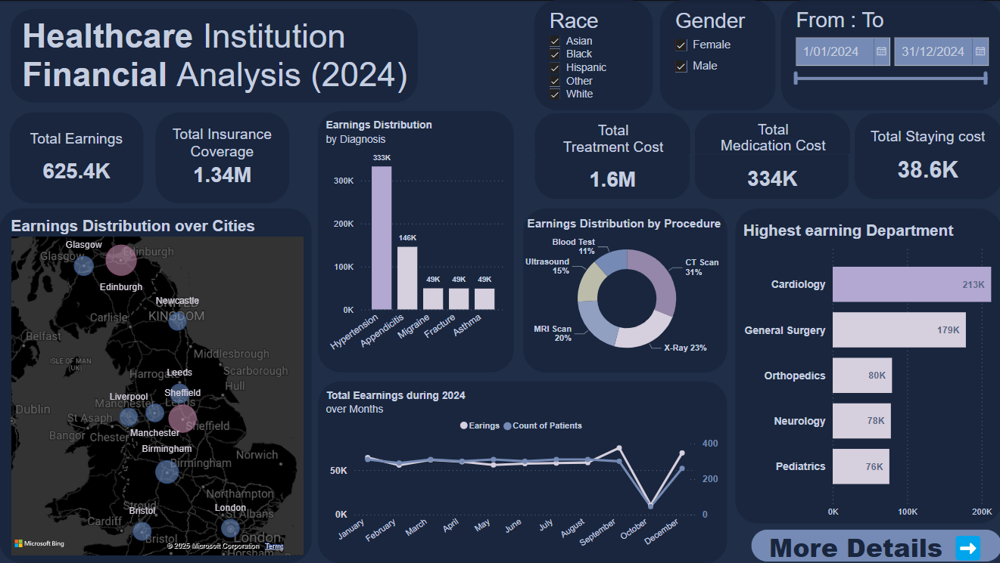
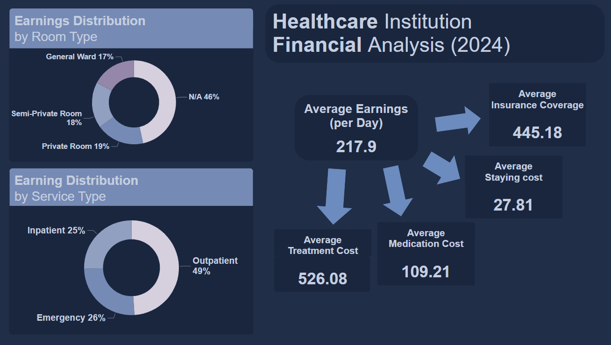

# Healthcare Institution - Financial Analysis (2024)

## **Table of Contents**
  - [Table of Contents](#table-of-contents)
  - [Collection](#collection)
  - [Cleaning](#cleaning)
  - [Strategic Insights](#strategic-insights)
  - [Recommendations](#recommendations)
  - [Conclusion](#conclusion)
  - [Thank you](#thank-you)

## **Collection**
- 7 CSV files Loaded in Power BI **`data model`**.

---

## **Cleaning**  
1. Fixed **`40 cities ids`** in **patients table** by using the **`10 city names`** instead (by using meged query).
2. Fixed **`4973 patient`** id in **visits table** by using the **`400 patient`** name instead (by using meged query).  
3. Fixed **insurance coverage** from **`null --> 0`**.  
4. Date of visit & discharged date **datatype** to **`datetime`**.  
5. **`negative`** numbers to **`zero`**.  
6. Added a calculated column **`stayed days`** = **discharged date** - **date of visit**.
7. Added a calculated column: **`staying cost`** = **stayed days** * **daily rate**  
8. Added a calculated column: **`total due`** = **treatment cost** + **medcial cost** + **stayed days cost** - **insurance cost**

---

## **Strategic Insights**  
1. **Financial Gap**:  
   - Treatment costs (1.6M) exceed total earnings (625.4K), indicating inefficiencies.
2. **Top Diagnoses & Procedures**:  
   - Appendicitis (333K) leads earnings, with CT Scans (31%) as the highest-earning procedure.
3. **Department Performance**:  
   - Cardiology (213K) and General Surgery (179K) dominate revenue.
4. **City Contributions**:  
   - Glasgow, Edinburgh, and Sheffield generate the most earnings.
3. **Earnings Trend**:  
   - A dip in October suggests seasonal fluctuations.
3. **Cost Breakdown**:  
   - Medication (334K) and staying costs (38.6K) need optimization.

---

## **Recommendations**  
1. **Reduce Cost Inefficiencies**:  
   - Optimize treatment expenses and insurance claims.
2. **Boost High-Earning Areas**:  
   - Expand CT, MRI, and X-ray services; invest in Cardiology & Surgery.
3. **Target High-Potential Cities**:  
   - Strengthen presence in top-performing locations.
4. **Stabilize Earnings**:  
   - Address the October dip with marketing and service adjustments.
4. **Cut Costs**:  
   - Negotiate better medication deals and optimize patient stays.
---

## **Conclusion**  
The analysis highlights a financial gap that must be addressed through cost optimization and revenue growth. By focusing on high-earning procedures, top-performing cities, and efficient resource management, the institution can enhance profitability and sustainability.

---

## Thank you 

